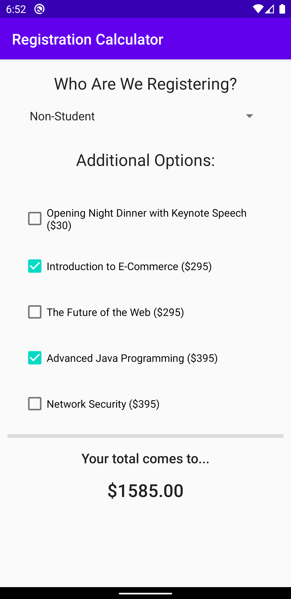

# Conference Registration System Example Application

This is a demo Android application, with the idea coming from a Java textbook problem:

> Create an application that calculates the registration fees for a conference. The general conference registration fee is $895 per person, and student registration is $495 per person. There is also an optional opening night dinner with a keynote speech for $30 per person. In addition, the optional preconference workshops listed below are available. The application show allow the user to select the registration type, the optional opening night and dinner keynote speech, and as many preconference workshops as desired. The total cost should be displayed.

|          Workshop          | Fee  |
|:--------------------------:|------|
| Introduction to E-commerce | $295 |
| The Future of the Web      | $295 |
| Advanced Java Programming  | $395 |
| Network Security           | $395 |

---

## Some Context...

Originally the intended workflow was to utilize JavaFX -- however I was following along with a streamer on [Twitch (Nicholai518)](https://www.twitch.tv/nicholai518), and he was already working on the JavaFX version!

My intentions were to just provide additional content, so that anyone would be able to browse the repository and see how the application is built. Who knows, maybe it inspires someone to [start working on Android Applications](https://developer.android.com/) :)

You are free to download and install the application by utilizing the APK in ```assets/app-debug.apk``` (Bonus: or download this repository to your computer, and try to build it yourself!)

_For those who might be unfamiliar with the typical structure of an Android application, if you're looking for the code to the application, take a look at the ```app/src/main/java/com/example/android/conregsys``` folder, and you'll want to focus on ```FirstFragment.java``` and ```SelectionModel.java```_

---

## Some final words...

> _If you seek the means to live to your true potential, I can guide you to it. There is power in knowledge. I leave you with those words, and these parting gifts. Take them, and grow fat from strength._ <sup>[-Emperor Calus](https://commons.ishtar-collective.net/t/leviathan-raid-transcript/1149), kinda...</sup>

I challenge you to expand your horizons (whether that's now, or come back and do this at a later time!), and to do the following:

- Fork this repository
- Download your fork to your computer
- Open the folder as a project in [Android Studio](https://developer.android.com/studio)
- Make some changes! Try adding some more additional options, or another type of person to register (Child? Military? Senior? Etc)
- Update this file (```README.md```) with the details of your changes (don't forget to update the media!)
- Push your changes to your fork
- Open an issue on this repository with a link to your fork, so that I can list it here in the README!
    - _Additional challenge_: Create a Pull Request instead of an issue, and add a link to your repository for me, and learn what Pull Requests are, and how they work :)

---

## Media
### Screenshot: 



### Video:
